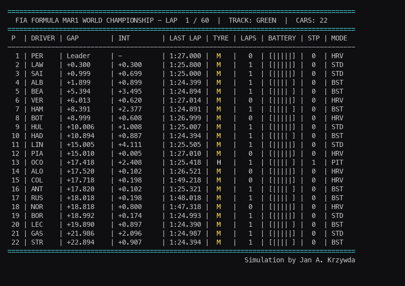

# Formula Mar1 · Multi-Agent RL for F1 Strategy

A **multi-agent reinforcement learning** research project for Formula 1 race strategy. This repo contains a full-race F1-style simulation environment where each car (agent) makes strategic decisions on tyres, pit stops, and energy deployment—designed as a testbed for learning coordinated race strategies.



---

## What’s in the repo

- **F1 race simulation** — Lap-by-lap simulation of a full grand prix (e.g. 60 laps, 22 cars) with:
  - **Tyres**: Medium (M), Hard (H), Soft (S), with wear and pit stops
  - **Energy**: Battery level and deployment modes (Harvest, Standard, Boost, Overtake)
  - **Standings**: Position, gap, interval, last lap time, laps on current tyres, pit count

- **Terminal UI** — Live race view in the terminal, styled like a broadcast timing screen (“FIA Formula Mar1 World Championship”).

- **GIF export** — The notebook can render the race to an animated GIF (like the one above) for sharing and analysis.

- **MARL-ready setup** — The environment is structured so each car can be controlled by a separate agent, with shared state (standings, track conditions) and individual actions (pit, tyre choice, energy mode), suitable for multi-agent RL experiments.

---

## Quick start

1. Clone the repo and open the Jupyter notebook:
   ```bash
   git clone <repo-url>
   cd marl-f1
   jupyter notebook test.ipynb
   ```
2. Run all cells to simulate a full race and (optionally) generate the GIF.

---

## Simulation details

- **Track state**: e.g. “Green” (no rain); can be extended for weather.
- **Driver/team data**: Placeholder names (PER, LAW, SAI, etc.) for 22 cars.
- **Modes**: HRV (harvest), STD (standard), BST (boost), OVR (overtake), PIT (in pit).
- **Battery**: Displayed as a simple bar; usage depends on mode and can be hooked to rewards for MARL.

The goal is to use this environment to train agents that learn when to pit, which compound to use, and how to manage energy over the race—both individually and in a multi-agent setting.

---

## License

See repository license. Simulation by Jan A. Krzywda.
