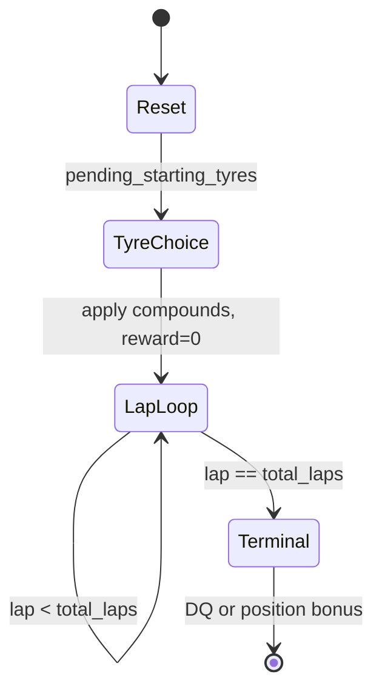
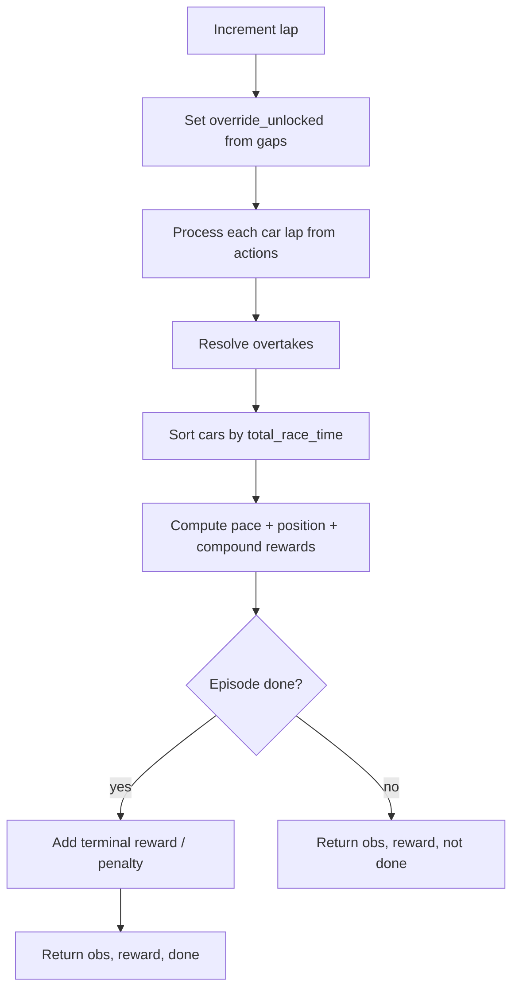
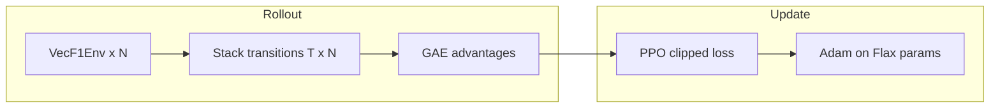

# Formula Mar1: Technical Reference for RL + Blog Adaptation

*The Python API on GitHub Pages is built with **Sphinx** from `*.py`; this file is narrative Markdown in `docs/`.*

*Part of the [documentation guide](guide.md).*

This document summarizes the **multi-agent Formula 1–style racing simulation**, the **reward design**, and the **JAX / Flax PPO + behavioral cloning** pipeline used in this repository. It is written so another model or author can turn it into a long-form blog post, talk, or tutorial.

---

## 1. Elevator pitch

**What:** A discrete-time, turn-based race simulator with **11 teams × 2 cars = 22 drivers**. One team (**BlueCow**) is controlled by a neural policy; other teams follow **fixed scripted pit strategies** (1-stop or 2-stop) as baselines.

**Why RL:** The agent must jointly choose **starting tyres**, **pit compounds and timing**, and **per-lap energy modes** (harvest / boost / standard) under **tyre degradation**, **ERS/battery** constraints, **stochastic overtakes**, and a **two-compound rule** (each car must run at least two different dry compounds in the race).

**How:** A shared **actor–critic** network outputs two **6-way categorical** distributions (one per car) plus a **scalar value**. Training uses **behavioral cloning** on a heuristic, then **Proximal Policy Optimization (PPO)** with **GAE** for advantage estimation, **batched vectorized environments**, and **logit masking** when the observation indicates a pre-race tyre-selection step.

---

## 2. Problem framing (for a blog)

### 2.1 Single-agent control in a multi-car world

Although 22 cars interact, the **learning problem** is **single-team**: the policy only sees **BlueCow’s** observation and produces **two actions per timestep** (car 1 and car 2, ordered by driver id). Opponents do not learn; they execute `get_benchmark_action`. This is a **partially observed, stochastic game** from BlueCow’s perspective, but the implementation trains it as a **stationary MDP** where other teams are part of the environment dynamics.

### 2.2 Time structure

- Default **race length:** `total_laps = 60` (configurable).
- Each **environment step** advances **one lap** for every car after the race has started.
- **Pre-race:** One special step sets **starting compounds** for all cars (no lap advanced, zero reward).

**Total timesteps per episode for training:** `total_laps + 1` (tyre step + 60 laps).

---

## 3. Episode lifecycle

### 3.1 Reset

1. **Grid:** Drivers are **shuffled**; `total_race_time` is staggered by grid slot (`grid_pos * 1.5` seconds) to break ties.
2. **State:** Tyre age/wear, battery, compounds used, pit count, etc., are initialized. `pending_starting_tyres = True`.
3. **Observation:** Each team gets a vector including a flag **pending_starting_tyres** (last scalar = 1).

### 3.2 Starting-tyre step (`pending_starting_tyres`)

- **Actions** use the **same 6 logits** as racing, but **logits 3–5 are masked** (−∞): only **0,1,2** are valid, meaning **Soft / Medium / Hard** (indices map to compounds 1–3).
- **Reward:** 0 for all teams.
- **Baselines** in vectorized training send **[1,1]** (medium) so scripted behaviour matches the old default.

### 3.3 Racing steps

For each lap: compute **override_unlocked** (gap to car ahead &lt; 1s → can use full “overtake” boost mode), apply each car’s action (`_process_car_lap`), resolve **stochastic overtakes**, re-sort field by `total_race_time`, compute **team rewards**, increment `current_lap`, check **done** when `current_lap >= total_laps`.

### 3.4 Terminal

On the **last lap’s** step, if the episode ends: apply **disqualification penalty** if any car on the team has fewer than **two** distinct compounds used; else add **position bonus** from a linear weight vector over 22 positions.

---

## 4. Observation space (`TEAM_OBS_DIM = 14`)

Per-team vector (same for every team; **BlueCow** is what the policy uses):

| Index / block | Content | Notes |
|----------------|---------|--------|
| 1 | `current_lap / total_laps` | Progress in [0,1] |
| Per car × 2 | `tyre_compound / 3` | 1=Soft, 2=Med, 3=Hard |
| | `tyre_age / 50` | Scaled |
| | `battery` | ERS state in [0,1] |
| | `override_unlocked` | 0/1 — full boost vs boost |
| | `gap_ahead / gap_behind` | Clipped to ±30s, then ÷30 |
| 1 | `pending_starting_tyres` | 1.0 = tyre step; 0.0 = racing |

**Design note:** Gaps are **race-time gaps**, not spatial; the “leader” is the minimum `total_race_time`.

---

## 5. Action space (`NUM_CAR_ACTIONS = 6`)

Each car chooses one discrete action per lap (or per tyre step):

| Action | Meaning |
|--------|---------|
| 0 | Pit → **Soft** |
| 1 | Pit → **Medium** |
| 2 | Pit → **Hard** |
| 3 | Stay out — **Harvest** (recharge, slower lap) |
| 4 | Stay out — **Boost** (deploy; may be **BST** or **OVR** depending on gap + battery) |
| 5 | Stay out — **Standard** |

**Pre-race masking:** When `obs[..., -1] == 1`, only **0–2** are valid (starting compound choice). Implemented in `ppo.py` as additive logit mask.

**Team tensor:** Shape `(2,)` — actions for **car with lexicographically smaller id** first, then the other car (consistent ordering).

---

## 6. Physics and strategy model (simplified)

### 6.1 Lap time

Each lap:

\[
\text{lap\_time} = 85 + \Delta_{\text{compound}}(\text{tyre}) + (\text{tyre\_wear})^3 + \Delta_{\text{pace}} + \mathcal{N}(0, 0.2^2) + \text{pit\_loss}
\]

- **Compound offset:** Soft faster, Hard slower (see `tyre_pace_deltas` in `formula_mar1/env.py`).
- **Wear:** Accumulates per lap; penalty is **cubic** in wear — rewards managing deg.
- **Pace modes:** Harvest adds positive modifier (slower); Boost subtracts (faster) if battery allows; else falls back to standard-like behaviour.
- **Pit:** Adds ~25s pit loss when the action is a pit stop.

### 6.2 Battery / ERS

- Harvest increases battery; Boost decreases it.
- **Leader** cannot unlock “overtake” mode; **&lt;1s to car ahead** enables stronger boost branch (**OVR** vs **BST**).

### 6.3 Overtakes

Pairwise check along grid order; **probability** depends on attacker/defender **mode** (OVR/BST), **tyre age delta**, and uniform randomness. Outcome nudges `total_race_time` (and `last_lap_time`) so positions evolve without a full continuous physics model.

### 6.4 Two-compound rule

Each car tracks `compounds_used` (set of compound ids). **Regulation:** at least **two** distinct compounds by end of race. Implemented via:

- **Dense penalty** while `len(compounds_used) < 2`: scales with race progress.
- **Dense bonus (+0.5)** the **first** lap a car transitions to having ≥2 compounds (critical for credit assignment in PPO).
- **Terminal −10** if still illegal at flag.
- **Terminal position bonus** if legal.

---

## 7. Reward structure (per lap, then terminal)

For each **racing** step, **each car** contributes **pace shaping** to **its team**:

\[
r_{\text{pace, car}} = \frac{87 - \text{pace\_time}_{\text{adjusted}}}{500}
\]

`pace_time_adjusted` uses `last_lap_time` minus most of the pit penalty so pit stops are not “double punished” in the dense term.

**Additional terms:**

- **Position change** (non-pit cars only): ±0.01 per position gained/lost vs start of step (values in code—confirm `formula_mar1/env.py` if tuning).
- **Compound rule:** progress-shaped penalty; **+0.5** when a car first satisfies two compounds.
- **End of episode:** DQ **−10** or sum of **position weights** in `np.linspace(1, -1, 22)` for the two cars’ finishing positions.

**Important:** Rewards are **team-level**; BlueCow’s return is `rewards["BlueCow"]`.

---

## 8. Learning algorithm

### 8.1 Architecture (`formula_mar1/networks.py`)

- **Input:** `LayerNorm` on 14-dim observation.
- **Trunk:** Dense 128 → residual block ×2 → Dense 64.
- **Heads:** Two **Dense(6)** logits (car 1 / car 2); one **Dense(1)** value baseline.

### 8.2 Behavioral cloning (BC)

- Roll out **BlueCow** with **fixed 1-stop benchmark** + optional **energy mix** (`BC_ENERGY_MIX_PROB`) so actions 3–5 appear in the dataset.
- **Pit actions** oversampled (`BC_PIT_OVERSAMPLE`) and **upweighted** in cross-entropy (`BC_PIT_LOSS_WEIGHT`).
- Includes **starting-tyre** transition (medium, medium) to match BC labels.
- Produces a warm start saved as `f1_best_weights.pkl` before PPO.

### 8.3 PPO (`formula_mar1/ppo.py`, `formula_mar1/train.py`)

- **Rollouts:** `VecF1Env` runs **N** parallel races; multiple **rounds** per update increase batch size.
- **Horizon:** `T = total_laps + 1` steps (includes tyre step).
- **GAE:** `compute_gae_batched` with configurable `gamma`, `lambda`.
- **Update:** Clipped surrogate; **advantages normalized** per batch; value loss MSE; **entropy bonus** with linear decay across training.
- **Optimizer:** Adam with learning rate from `formula_mar1/train.py`.

### 8.4 Evaluation

- Greedy argmax on masked logits; same episode loop as training with scripted opponents.
- Optional **EMA** on eval return for smoother checkpoint selection; TensorBoard scalars for train/eval.

---

## 9. Key implementation files

| File | Role |
|------|------|
| `formula_mar1/env.py` | `F1TeamEnv`, rewards, tyre step, benchmarks |
| `formula_mar1/vec_env.py` | Parallel envs, BlueCow actions + scripted others |
| `formula_mar1/networks.py` | Flax `F1AgentNN` |
| `formula_mar1/ppo.py` | GAE, PPO loss, logit masking |
| `formula_mar1/train.py` | BC + PPO loop, eval, checkpoints |
| `evaluate.py` | Visual / GIF evaluation |
| `analysis/analyze_rewards.py` | Per-lap telemetry plots |

*Class / function reference (Sphinx):* [**Module index**](https://jan-a-krzywda.github.io/formula-mar1/py-modindex.html) · [Index](https://jan-a-krzywda.github.io/formula-mar1/genindex.html).

---

## 10. Suggested Mermaid diagrams (for the blog)

### 10.1 Episode state machine



### 10.2 Single environment step (racing)



### 10.3 Training data flow



### 10.4 Action masking

```mermaid
flowchart LR
    O[obs[..., -1] == 1?] -->|yes| M[Mask logits 3,4,5 = -inf]
    O -->|no| F[Full 6-way softmax]
    M --> A[Sample / argmax]
    F --> A
```

---

## 11. Other illustrative ideas (non-Mermaid)

1. **Telemetry screenshot** — Terminal board from `formula_mar1/render_utils.py` showing MODE (HRV/BST/OVR/STD), tyre, battery bars.
2. **Stacked area chart** — Decompose mean episode return into pace / position / compound / terminal (requires logging components separately—currently combined).
3. **Heatmap** — Pit lap vs final position over many seeds for the benchmark vs learned policy.
4. **TensorBoard** — `Training/Mean_Reward_EMA`, `Eval/EMA`, policy/value loss curves after stabilizing hyperparameters.
5. **Cartoon grid** — 22 slots, two highlighted cars per team, arrow “policy only controls one team.”

---

## 12. Hyperparameters (reference — verify `formula_mar1/train.py`)

These are **typical** values; the source of truth is always the code:

| Symbol / name | Purpose |
|-----------------|--------|
| `NUM_ENVS` | Parallel episodes per rollout batch |
| `ROLLOUT_ROUNDS` | Repeat rollouts per PPO update |
| `NUM_PPO_EPOCHS` | Epochs over the same batch |
| `LR` | Adam step size |
| `GAMMA`, `LAM` | GAE discount and trace decay |
| `ENTROPY_COEF_*` | Exploration annealing |
| BC: `NUM_BC_EPISODES`, `BC_LR`, `BC_PIT_OVERSAMPLE`, `BC_ENERGY_MIX_PROB` | Imitation learning strength |

---

## 13. Limitations and honest caveats (good for a blog “discussion”)

- **Not a physics engine:** Lap times are **tabular + noise + cubic wear**; no track map, no slipstream model beyond simple rules.
- **Opponents are static scripts:** No self-play; generalization is to **noise + grid randomization**, not to adapting opponents.
- **Reward engineering:** Success depends heavily on **dense compound bonus (+0.5)** and **terminal DQ**; ablations matter.
- **Credit assignment:** Two cars share one value function; **multi-agent credit** is implicit via summed team reward.
- **Compute:** JAX Flax on CPU/GPU; vectorization trades memory for wall-clock.

---

## 14. Glossary for readers

| Term | Meaning in this codebase |
|------|---------------------------|
| **OVR / BST / HRV / STD** | Modes after a lap: overtake boost, boost, harvest, standard |
| **ERS** | Battery state driving boost eligibility |
| **Two-compound rule** | Each car must use ≥2 distinct compounds (F1-style sporting reg) |
| **Benchmark** | Rule-based pit strategy (1-stop M→H or 2-stop) |
| **BlueCow** | Trainable team name (arbitrary) |

---

## 15. Prompt snippet for an LLM “write the blog post”

You can paste the following with this file:

> Write a technical blog post for developers interested in reinforcement learning. Use the structure: hook, problem setup, environment design (obs/actions/rewards), why BC+PPO, training tips, diagrams described in section 10, limitations in section 13, and a short conclusion. Tone: clear, not hype. Audience: ML engineers who know PPO at a high level. Length: 2000–3500 words. Include one Mermaid diagram in fenced code blocks.

---

*Document generated to match the `formula-mar1` repository layout; when the code changes, prefer the implementation over this file.*
